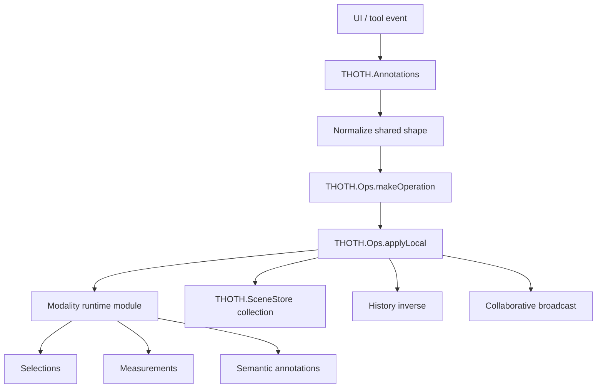

# Annotation API

The shared annotation API normalizes common fields across selections, measurements, and semantic annotations. Modality-specific modules still own geometry/runtime behavior, but canonical create/update/delete operations pass through `THOTH.Annotations` and `THOTH.Ops`.



## Supported Modalities

| Modality | Collection | Operation Prefix |
| --- | --- | --- |
| Selection | `selections` | `selection` |
| Measurement | `measurements` | `measurement` |
| Semantic annotation | `semantic_annotations` | `semantic_annotation` |

## Canonical Shape

All annotation modalities share this exported shape:

```js
{
    id: "annotation-id",
    name: "Display name",
    description: "",
    related_rgb_images: [],
    related_multispectral_images: [],
    related_artefacts: [],
    annotation: {},
    visible: true
}
```

Runtime-only fields such as mesh references, temporary nodes, cached paths, face hit data, and `model_id` are stripped before export.

## Public Surface

- `THOTH.Annotations.setup()`
  Registers the supported modality map.

- `THOTH.Annotations.normalize(annotation)`
  Produces the shared canonical annotation shape and normalizes relation arrays.

- `THOTH.Annotations.create(modelId, modality, annotation)`
  Creates a normalized item and applies a `{prefix}.create` operation.

- `THOTH.Annotations.update(modelId, modality, annotationId, data)`
  Merges data into the existing item and applies a `{prefix}.update` operation.

- `THOTH.Annotations.delete(modelId, modality, annotationId)`
  Applies a `{prefix}.delete` operation using the previous item as `prev_value`.

- `THOTH.Annotations.setVisible(modelId, modality, annotationId, visible)`
  Updates only the `visible` state through the same operation pipeline.

- `THOTH.Annotations.getExportData(modelId, modality)`
  Returns non-trash annotations for a model collection with runtime fields removed.

## Operation Flow

`Annotations` does not mutate collections directly. It builds targets like:

```js
{
    model_id  : "model-a",
    collection: "selections",
    item_id   : "selection-1",
    field     : "visible"
}
```

Then `THOTH.Ops.applyLocal()` routes the operation to the correct runtime module and updates `SceneStore`. This keeps annotation edits compatible with history, export, and collaboration.

