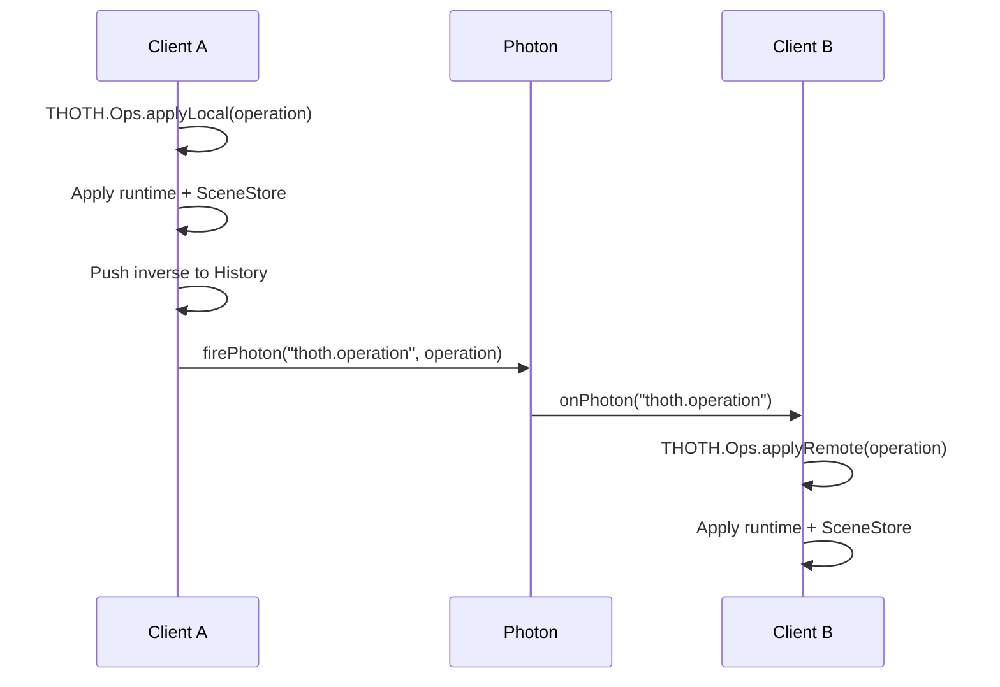

# Collaborative API

THOTH collaboration is a thin layer over ATON Photon events. Local mutations are converted to canonical operations, broadcast as `thoth.operation`, and applied remotely without entering the remote user's history stack.



## Public Surface

- `THOTH.Collab.parseCollab(collab)`
  Enables collaboration when scene data contains `collaborative: true`.

- `THOTH.Collab.syncScene(sceneObject)`
  Replaces local runtime maps, reparses `SceneStore`, rebuilds frontend state, and asks `ATON.SceneHub` to parse the scene object.

- `THOTH.Events.setupPhotonEvents()`
  Registers `THOTH.onPhoton("thoth.operation", operation => THOTH.Ops.applyRemote(operation))`.

- `THOTH.Ops.broadcast(operation)`
  Sends local/history operations with `THOTH.firePhoton("thoth.operation", operation)` when `THOTH.collaborative` is enabled.

## Remote Apply Rules

`THOTH.Ops.applyRemote(operation)` rejects operations whose `user_id` matches the current local user. Accepted remote operations are applied with:

```js
{
    pushHistory: false,
    broadcast  : false
}
```

This prevents echo loops and prevents remote changes from entering local undo/redo.

## Scene Sync

`THOTH.Collab.syncScene()` is the full-state resync path. It clears selection/model/measurement/semantic annotation runtime maps, resets related frontend containers, parses the canonical scene store, then reparses the scene through `ATON.SceneHub`.

The current active operation channel is `thoth.operation`. Older direct Photon mutation events should stay retired.

