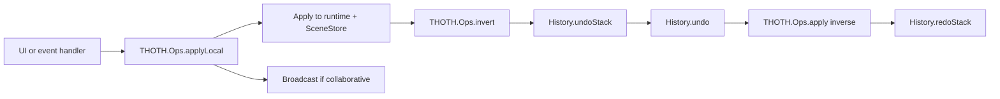

# History API

THOTH history is operation-based. Runtime features do not push arbitrary UI state into history; they create canonical operations through `THOTH.Ops`, and the history stack stores the inverse operation needed to undo them.



## Public Surface

- `THOTH.History.setup()`
  Initializes `undoStack` and `redoStack`.

- `THOTH.History.push(inverseOperation)`
  Stores an inverse operation for local changes only, then clears the redo stack.

- `THOTH.History.undo()`
  Pops a local inverse operation, applies it through `THOTH.Ops.apply()`, broadcasts it, and stores its inverse on the redo stack.

- `THOTH.History.redo()`
  Pops a local redo operation, applies it through `THOTH.Ops.apply()`, broadcasts it, and stores its inverse on the undo stack.

- `THOTH.History.clear()`
  Clears both stacks.

## Operation Contract

History expects operation objects produced by `THOTH.Ops.makeOperation()`:

```js
{
    type      : "selection.update",
    target    : { model_id, collection, item_id, field },
    value     : nextValue,
    prev_value: previousValue,
    user_id   : "local-user",
    timestamp : 1710000000000,
    source    : "local"
}
```

Undo and redo call `THOTH.Ops.apply()` with `pushHistory: false` so replaying history does not recursively create new history entries.

## Locality Rule

`History._isLocalOperation()` accepts operations with no `user_id` or with the current local user id. Remote collaborative operations are intentionally excluded from local undo/redo, so one user cannot undo another user's edits.

